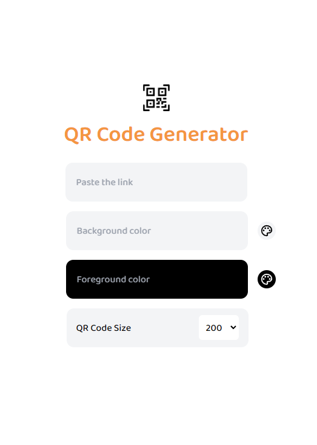

# QR Code Creator



This app allows you to create and customize QR codes with a simple interface.

## Features

- Customize QR code content (text, color, size.).
- Selecting background color and foreground color.
- Adjusting QR code size.

## How to use

1. You can enter or paste the QR code content.
2. Select background and foreground colors.
3. Determine the QR code size.
4. Download your QR code by clicking the dowland button.

## Setup

1. Clone the project:

```bash
git clone https://github.com/yemresalcan/create-qr-gen.git
cd create-qr-gen
npm install
